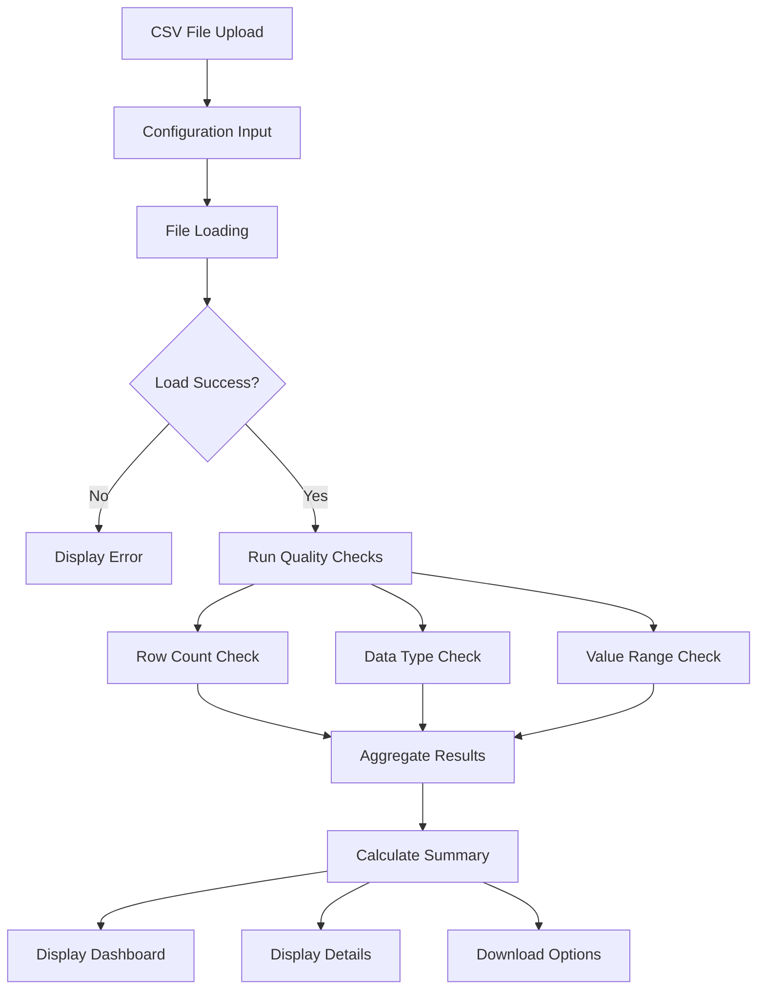
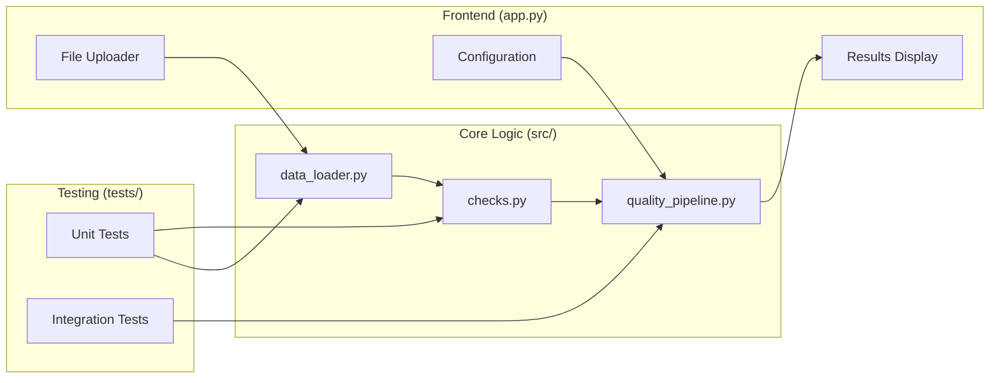
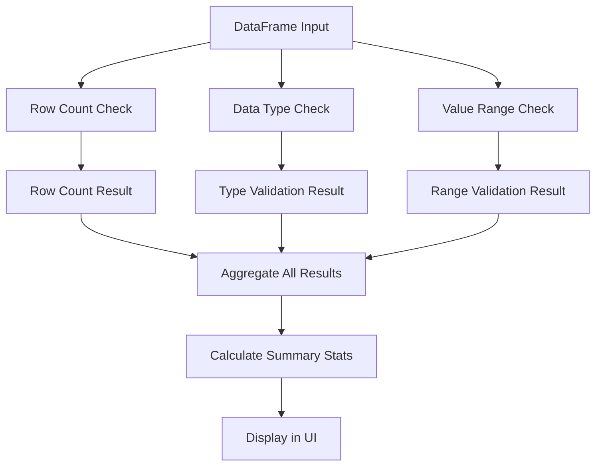

# Simple Data Flow Diagram

## High-Level Flow

```mermaid
graph TD
    A[CSV File Upload] --> B[Configuration Input]
    B --> C[File Loading]
    C --> D{Load Success?}
    D -->|No| E[Display Error]
    D -->|Yes| F[Run Quality Checks]
    F --> G[Row Count Check]
    F --> H[Data Type Check]
    F --> I[Value Range Check]
    G --> J[Aggregate Results]
    H --> J
    I --> J
    J --> K[Calculate Summary]
    K --> L[Display Dashboard]
    K --> M[Display Details]
    K --> N[Download Options]
```

## Detailed Component Flow

```mermaid
graph LR
    subgraph "Frontend (app.py)"
        A1[File Uploader]
        A2[Configuration]
        A3[Results Display]
    end
    
    subgraph "Core Logic (src/)"
        B1[data_loader.py]
        B2[checks.py]
        B3[quality_pipeline.py]
    end
    
    subgraph "Testing (tests/)"
        C1[Unit Tests]
        C2[Integration Tests]
    end
    
    A1 --> B1
    A2 --> B3
    B1 --> B2
    B2 --> B3
    B3 --> A3
    C1 --> B1
    C1 --> B2
    C2 --> B3
```

## Check Types Flow

```mermaid
flowchart TD
    Start[DataFrame Input] --> Check1[Row Count Check]
    Start --> Check2[Data Type Check]
    Start --> Check3[Value Range Check]
    
    Check1 --> Result1[Row Count Result]
    Check2 --> Result2[Type Validation Result]
    Check3 --> Result3[Range Validation Result]
    
    Result1 --> Aggregate[Aggregate All Results]
    Result2 --> Aggregate
    Result3 --> Aggregate
    
    Aggregate --> Summary[Calculate Summary Stats]
    Summary --> Display[Display in UI]
```